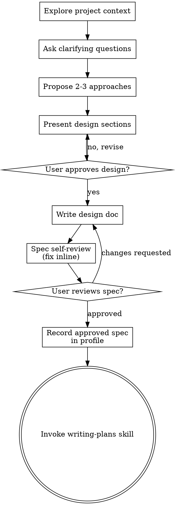

# Brainstorming Flow Details

This reference preserves extended brainstorming process detail. The main skill contains the gates and required workflow.

## Process Flow

The terminal state is invoking `writing-plans`. `frontend-design` may support UI discovery and spec writing, but implementation skills do not run from brainstorming.

## Extended Discovery Narrative

Start by checking the current project state: files, docs, recent commits, established architecture, and existing patterns. If the work is too large for one spec, decompose early rather than spending many questions refining an oversized request. Each independent sub-project should get its own spec, plan, and implementation cycle.

For appropriately scoped projects, ask questions one at a time. Multiple choice questions reduce user effort, but open-ended questions are appropriate when exploring goals or constraints. Keep each question focused on one topic so the user can answer cleanly.

## Extended Approach Narrative

When proposing approaches, ground each option in the request, codebase evidence, docs, or explicit assumptions. Present trade-offs conversationally, then recommend one option and explain why. If you lack enough evidence, name what is unknown instead of pretending certainty.

When deferring scope, avoid vague handoffs like “later” or “someone will pick this up.” Identify the successor issue, plan, backlog item, or spec. If none exists, ask whether to include the work now or create a follow-up artifact.

## Extended Design Narrative

Scale design sections to complexity: a few sentences for straightforward pieces, up to 200-300 words for nuanced sections. Cover architecture, components, data flow, error handling, and testing. For frontend work, include information hierarchy, responsive behavior, interaction states, accessibility, real assets/data, and product-specific visual constraints.

Design units should be understandable and testable in isolation. For each unit, be able to answer: what does it do, how is it used, and what does it depend on? If a file or module is too large to reason about, include focused decomposition only when it serves the current goal.
