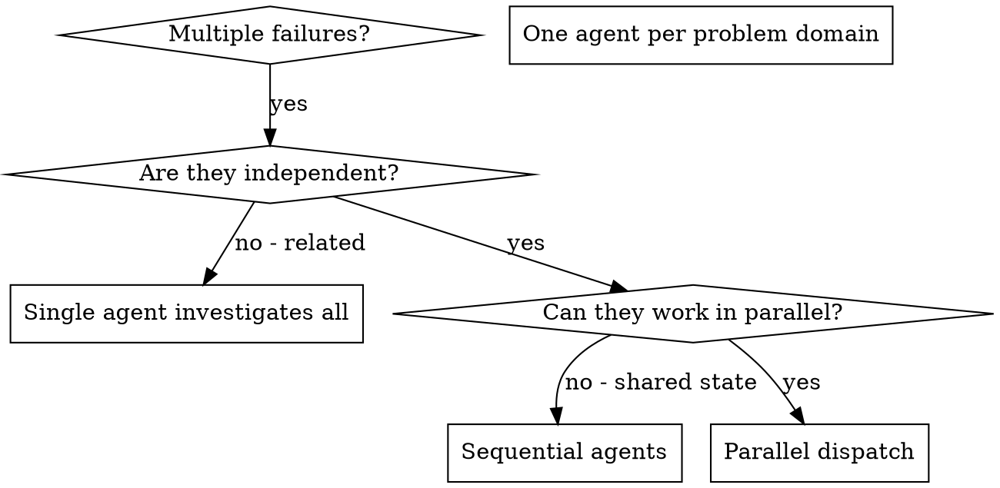

# Dispatching Parallel Agents

## Overview

You delegate tasks to specialized agents with isolated context. By precisely crafting their instructions and context, you ensure they stay focused and succeed at their task. They should never inherit your session's context or history — you construct exactly what they need. This also preserves your own context for coordination work.

When you have multiple unrelated failures (different test files, different subsystems, different bugs), investigating them sequentially wastes time. Each investigation is independent and can happen in parallel.

**Core principle:** Dispatch one agent per independent problem domain. Let them work concurrently.

The main agent remains the orchestrator. It owns the visible todo list, dispatch decisions, integration, review routing, validation, and commits. Parallel workers own only their assigned stream and report back; they do not mutate todos, choose later work, or spawn/dispatch/coordinate other subagents.

## When to Use

**Use when:**
- 3+ test files failing with different root causes
- Multiple subsystems broken independently
- Each problem can be understood without context from others
- No shared state between investigations

**Don't use when:**
- Failures are related (fix one might fix others)
- Need to understand full system state
- Agents would interfere with each other
- Each worker would need the same large context dump to be effective
- The tasks are small enough that dispatch overhead is larger than the work
- The work shares files, generated artifacts, migrations, external state, or validation commands in ways that make integration risky

When in doubt, keep investigation in the main session until the independent domains and file ownership boundaries are clear.

## Workflow Integration

This skill is a support action for `subagent-driven-development`, `executing-plans`, and `systematic-debugging`, not a standalone route. Use it when a plan, test failure set, or bug investigation has 2+ candidate work streams and the independence is not already obvious.

When named agents are available, dispatch `parallelization-advisor` first for non-trivial splits. Give it the plan or failure list, expected files, known dependencies, and active profile summary. It returns safe work streams and the recommended worker role for each stream.

After advisor output:

- Dispatch `implementer` for ordinary bounded streams.
- Dispatch `tdd-implementer` for tests-first or regression streams.
- Dispatch `debugging-investigator` for streams that still need root-cause evidence.
- Keep review agents separate from implementation workers.
- Do not run parallel implementation when file ownership or validation state overlaps.
- Create or update one coordinator-owned todo per worker stream and one integration/review todo for the parent task boundary.

## The Pattern

### 1. Identify Independent Domains

Group failures by what is broken and only split domains where one fix should not change another stream's files, validation state, or assumptions.

### 2. Create Focused Agent Tasks

Each agent gets:
- **Specific scope:** One test file or subsystem
- **Clear goal:** Make these tests pass
- **Constraints:** Don't change other code
- **No orchestration:** Don't update todos, spawn/dispatch/coordinate other subagents, or pick follow-up tasks
- **Expected output:** Summary of what you found and fixed

### 3. Dispatch in Parallel

Dispatch independent streams through the active harness's worker mechanism only after file ownership, validation commands, and integration gates are clear. For extended examples/details, read [parallelization examples](references/parallelization-examples.md) when this extra detail is needed.

### 4. Review and Integrate

When agents return:
- Read each summary
- Verify fixes don't conflict
- Run full test suite
- Integrate all changes

## Agent Prompt Structure

Good agent prompts are:
1. **Focused** - One clear problem domain
2. **Self-contained** - All context needed to understand the problem
3. **Specific about output** - What should the agent return?

Include exact failures, file ownership, constraints, validation, and required return fields. For extended examples/details, read [focused worker prompt example](references/parallelization-examples.md) when this extra detail is needed.

## Common Mistakes

**❌ Too broad:** "Fix all the tests" - agent gets lost
**✅ Specific:** "Fix agent-tool-abort.test.ts" - focused scope

**❌ No context:** "Fix the race condition" - agent doesn't know where
**✅ Context:** Paste the error messages and test names

**❌ No constraints:** Agent might refactor everything
**✅ Constraints:** "Do NOT change production code" or "Fix tests only"

**❌ Vague output:** "Fix it" - you don't know what changed
**✅ Specific:** "Return summary of root cause and changes"

## When NOT to Use

**Related failures:** Fixing one might fix others - investigate together first
**Need full context:** Understanding requires seeing entire system
**Exploratory debugging:** You don't know what's broken yet
**Shared state:** Agents would interfere (editing same files, using same resources)

## Examples

Keep examples out of the hot path. For extended examples/details, read [real-world parallel splits](references/parallelization-examples.md) when this extra detail is needed.

## Key Benefits

1. **Parallelization** - Multiple investigations happen simultaneously
2. **Focus** - Each agent has narrow scope, less context to track
3. **Independence** - Agents don't interfere with each other
4. **Speed** - 3 problems solved in time of 1

## Verification

After agents return:
1. **Review each summary** - Understand what changed
2. **Check for conflicts** - Did agents edit same code?
3. **Run full suite** - Verify all fixes work together
4. **Spot check** - Agents can make systematic errors
