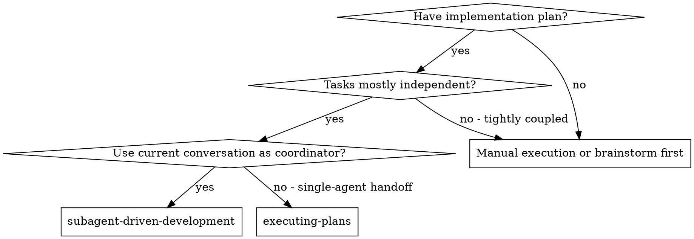

# Subagent-Driven Development

Execute implementation plans with subagents while keeping the main session as the orchestrator, using coordinator-owned dispatch todos, proportional review at meaningful task boundaries, and local commits only after verified implementation task scopes when workflow commits are enabled by the approved execution workflow.

If the active harness does not support subagents or worker dispatch, use `executing-plans` in the main session and preserve the same flat coordinator-owned todo boundaries.

**Why subagents:** You delegate work to specialized agents with isolated context. By precisely crafting their instructions and context, you keep them focused while preserving your own context for coordination.

**Core principle:** The main agent owns the todo list and orchestration. Each implementation todo maps to one bounded worker dispatch or a deliberately local coordinator action; workers perform assigned tasks and report back, but they do not plan the rest of the workflow, mutate todos, run review gates, or absorb a whole parent task when it contains multiple dispatchable units.

## When to Use



**vs. Executing Plans:**
- Current conversation remains the coordinator
- Fresh subagents where they add value
- Dispatch-scoped implementation todos, lite checkpoints after simple tasks, full task-scope spec review plus lite task-scope code review at task boundaries
- Faster iteration without human-in-loop between every small task

`executing-plans` is single-agent execution of the same plan boundaries. It may run in the current conversation or a separate handoff, but it does not use the current conversation as a subagent coordinator.

## When Not To Dispatch

Use subagents for independence, not ritual. Stay in the coordinator session or use `executing-plans` when:

- The change is small, tightly coupled, and easier to finish with one local context.
- The worker would need most of the coordinator's explored context to avoid guessing.
- The task is a quick-flow edit, wording change, config tweak, or localized review.
- The plan has sequential steps that all touch the same files and cannot be validated independently.
- Dispatch overhead would exceed the likely implementation time.

If you stay inline, preserve the same bounded `Task N.M` todo boundaries and review/validation gates.

## The Process

1. Read the plan once.
2. Read the active workflow profile before dispatching implementation work.
3. If `executionStrategy` is missing, ask the execution-strategy question before dispatching subagents.
4. After strategy is known, run branch preflight and invoke the selected setup skill before any implementation subagent dispatch: `using-git-worktrees` for `worktree`, `using-feature-branches` for `feature-branch`, or stop if the strategy is `hold`.
5. Record the resulting branch/worktree context in the workflow profile, including execution method, execution strategy, parent/source branch, selected durable branch, task branch, worktree path, and original workspace when relevant.
6. Pass a compact profile summary into implementer and reviewer prompts.
7. Extract task groups, tasks, dispatchable `Task N.M` units, dependencies, validation commands, review policies, and whether each implementation unit requires `implementer`, `tdd-implementer`, `debugging-investigator`, a reviewer, or coordinator-local work.
8. Replace any prior planning/brainstorming todos with one flat, coordinator-owned harness todo list.
9. Execute each todo in dependency order, dispatching the named worker/reviewer for that todo when it is not coordinator-local.
10. For each parent `Task N`, complete its dispatchable `Task N.M` implementation todos, lite checkpoints, task-scope validation, and required reviews.
11. Run task-scope review at parent task boundaries only when the plan, live settings, or risk calls for it; otherwise rely on dispatch validation plus the final full reviews.
12. Commit the verified parent task scope locally only when workflow commits are enabled by the approved execution workflow.
13. Run final full implementation review and validation across all tasks.
14. Commit verified remaining implementation changes locally only when workflow commits are enabled by the approved execution workflow.
15. Invoke `finishing-a-development-branch`, preserving whether execution happened on the current branch or in a temporary worktree/task branch.

Subagents honor the profile's testing intensity. For `major-behavior`, they test important behavior and integration points without creating exhaustive or obvious tests.

## Context Handoffs

Workers should receive compact, task-specific context:

- Stable workflow rules come from skills and agent definitions, not repeated prose in every prompt.
- Include the assigned `Task N.M`, relevant acceptance criteria, exact file ownership, validation commands, recent failure evidence, and known constraints.
- Include focused excerpts or file paths with line references instead of whole files when possible.
- Carry forward a compact `Project Discoveries` block when earlier workers found reusable codebase facts, gotchas, dependency quirks, or validation notes. Keep only discoveries that are likely to affect later tasks.
- Keep variable task data after stable instructions so repeated prompt prefixes remain cache-friendly.
- Do not pass the whole conversation unless the worker genuinely needs it to avoid a wrong implementation.

## Todo Status Discipline

Keep the coordinator-owned harness todo list current throughout orchestration:

1. Mark exactly one todo `in_progress` immediately before starting or dispatching that work.
2. Mark it `completed` immediately after its implementation, review, or validation is done.
3. Do not start the next todo, dispatch the next subagent, or report completion while the previous todo is still stale.

## Coordinator Todo Shape

Most harnesses do not support nested todos, but the visible todo list must still show the coordinator's actual dispatch plan. Keep it flat and dependency ordered. Use one visible todo per bounded worker assignment, review gate, validation gate, or finalization step. Do not collapse a whole parent task into one implementation todo when it contains multiple `Task N.M` units that should go to separate workers.

```markdown
- Task 0: Execution setup - read plan, classify task scopes, prepare context
- Task 1.1: Login validation tests - dispatch tdd-implementer
- Task 1.2: Login form behavior - dispatch implementer
- Task 1 Review: validate Task 1, run required reviewers, commit if enabled
- Task 2.1: Password reset token model - dispatch implementer
- Task 2.2: Password reset email flow - dispatch implementer
- Task 2 Review: validate Task 2, run required reviewers, commit if enabled
- Review: final full-scope spec review, code review, and validation
- Finalize: finish branch according to current execution mode
```

Each visible implementation todo names the exact plan unit, expected worker role, and bounded ownership scope. Parent `Task N Review` todos collect the task-scope validation, required reviewers, and coordinator-owned commit step after the child implementation todos report back. Do not create nested todo structures. Do not use `Group N` in harness todos. Do not expand every plan checkbox or mechanical command into a harness todo; expand the work at the level where the coordinator will make a dispatch, review, validation, dependency, or blocker-resolution decision.

If several adjacent plan steps are truly mechanical, affect the same files, and have one obvious validation command, the coordinator may combine them into one implementation dispatch todo. The prompt must still list the included steps explicitly and forbid the worker from continuing into later plan work.

## Review Policy

Use the cheapest review that matches the risk:

| Work type | Review |
|---|---|
| Mechanical or simple task | One lite review checkpoint, using `lite-spec-reviewer` and/or `lite-code-reviewer` only when useful |
| Normal task scope | Validation + lite code review when useful; full spec review only when plan-required or settings require per-chunk review |
| High-risk task | Full spec review + full code review before moving on |
| Final implementation | Full task-set spec review + full task-set code review + validation |

High-risk means security, auth, data loss, migrations, broad refactors, cross-cutting behavior, unresolved design judgment, or unexpected file changes.

If a lite review finds a material concern, escalate that task scope to full spec and/or full code review before moving on.

Review loop budget: after a reviewer reports issues, group the findings, fix them once, and request one focused re-review of the changed scope. If material issues remain, escalate once to the stronger reviewer or ask the human; do not repeat the same reviewer prompt with unchanged context.

## Commit Cadence

When workflow commits are enabled by the approved execution workflow, the coordinator commits locally after each parent task scope passes its required reviews and validation. This creates small, reviewable commits for each verified implementation task scope, then a final commit for any verified remaining implementation changes. Ordinary sessions must not commit unasked.

Implementer subagents do not commit directly. They report changed files and verification results; the coordinator reviews the aggregate diff, writes the commit message, and commits only after the task boundary is clean. In worktree or temporary task-branch execution, keep commits on that branch and let finishing-a-development-branch handle integration back to the parent/source branch. Do not push unless the user explicitly requests it.

## Reviewer Routing

- Lite review checkpoint: dispatch `lite-spec-reviewer`, `lite-code-reviewer`, both, or neither based on the task's risk and the implementer's report. Do not split lite checks into visible harness todos unless they are real dependency boundaries.
- Lite code review: dispatch `lite-code-reviewer` across the completed parent task scope.
- Full spec review: dispatch `spec-reviewer`.
- Full code review: dispatch `code-reviewer`.

For platforms without named agents, use the matching prompt templates in this skill directory.

## Worker Routing

- Normal implementation task: dispatch `implementer` with the exact task text, expected files, validation commands, compact profile summary, and forbidden branch/git operations.
- Tests-first task, regression fix, or plan-required TDD: dispatch `tdd-implementer` instead of `implementer`.
- Complex bug task where root cause is not yet proven: dispatch `debugging-investigator` first. Only dispatch an implementation worker after it reports a supported root-cause hypothesis or the human approves proceeding.
- Multiple apparently independent task streams: use `parallelization-advisor` before dispatching parallel workers unless the independence is already explicit in the plan.

Implementation workers may edit assigned files but must not commit, mutate todos, spawn their own implementation subagents, or decide the next plan task. The coordinator owns todo state, dependency ordering, worker selection, review, validation gates, and local commits.

## Model Selection

Use the least powerful model that can handle each role to conserve cost and increase speed.

**Mechanical implementation tasks** (isolated functions, clear specs, 1-2 files): use a fast, cheap model.

**Integration and judgment tasks** (multi-file coordination, pattern matching, debugging): use a standard model.

**Architecture, design, and full review tasks**: use the most capable available model.

## Handling Implementer Status

Implementer subagents report one of four statuses. Handle each appropriately:

After each implementer report, merge any `Project Discoveries` into the compact discovery block for later dispatches. Deduplicate aggressively and drop one-off facts that are not reusable.

**DONE:** Proceed to the task's review policy: lite checkpoint for simple work, full review for high-risk work, or task-scope review when the parent task boundary is reached.

**DONE_WITH_CONCERNS:** Read the concerns before proceeding. If they affect correctness, scope, or validation, escalate to full review before moving on.

**NEEDS_CONTEXT:** Provide the missing context and re-dispatch.

**BLOCKED:** Assess the blocker:
1. If it's a context problem, provide more context and re-dispatch with the same model
2. If the task requires more reasoning, re-dispatch with a more capable model
3. If the task is too large, break it into smaller pieces
4. If the plan itself is wrong, escalate to the human

## Re-Evaluation Gates

If a worker reports two failed implementation attempts in the same assigned scope, stop that scope and re-evaluate:

- Light adjustment that preserves the approved spec: update the plan/spec note and continue with the revised approach.
- Major design, dependency, architecture, data-model, security, or product decision: do not decide silently. Ask the user, or code a minimal placeholder seam and complete independent tasks that remain valid.
- Tool/file-discovery failure repeated twice: change tactics or ask for targeted context rather than repeating the same search.

When a worker returns `NEEDS_CONTEXT`, provide only the missing context needed for its assigned scope. When a worker returns `BLOCKED`, do not ask the same worker to keep trying without a changed plan, new evidence, smaller task, or clarified decision.

**Never** ignore an escalation or force the same model to retry without changes.

## Prompt Templates

- `./implementer-prompt.md` - Dispatch implementer subagent
- `./spec-reviewer-prompt.md` - Full spec compliance review fallback
- `./code-quality-reviewer-prompt.md` - Full code quality review fallback
- `./lite-spec-reviewer-prompt.md` - Lite spec checkpoint fallback
- `./lite-code-reviewer-prompt.md` - Lite code checkpoint fallback

## Example Workflow

```markdown
You: I'm using Subagent-Driven Development to execute this plan.

[Read plan file once: {DOCS_ROOT}/superduperpowers/plans/feature-plan.md]
[Extract groups and tasks with full text and context]
[Create flat coordinator-owned todos with setup, one visible todo per bounded worker dispatch or review gate, Review, and Finalize]

Task 1.1: Hook installation model
[Dispatch implementer with Task 1.1 text + context]
Implementer: DONE, tests passing, changed files reported.

Task 1.2: Hook installation command flow
[Dispatch implementer with Task 1.2 text + context]
Implementer: DONE, tests passing, changed files reported.

Task 1 Review: Optional task-scope review when plan/risk/settings require it
[Dispatch lite-code-reviewer or spec-reviewer against the Task 1 diff]
Result: Approved

Review: final full task-set spec review, code review, and validation
Finalize: invoke finishing-a-development-branch
```

## Red Flags

**Never:**
- Start implementation on main/master branch without explicit user consent
- Treat current-branch execution as a worktree cleanup/merge flow
- Create nested or overly expanded harness todo structures; keep todos flat and dispatch-scoped
- Collapse multiple dispatchable plan tasks into one broad implementer assignment
- Skip the review required by the task review policy
- Proceed with unfixed full-review issues
- Dispatch multiple implementation subagents in parallel if they can conflict
- Make subagents read the plan file; provide full text instead
- Let subagents mutate todos, choose later tasks, or orchestrate other subagents
- Skip scene-setting context
- Ignore subagent questions
- Let implementer self-review replace required task-scope or final review
- Move past a task scope while required review has open issues
- Let implementer subagents create their own commits instead of coordinator-owned task-scope commits

**If reviewer finds issues:**
- Implementer or fix subagent fixes them
- Reviewer gets one focused re-review of the changed scope
- If material issues remain, escalate once to the stronger reviewer or the human

## Integration

**Required workflow skills:**
- **writing-plans** - Creates the plan this skill executes
- **using-feature-branches** - Required setup for feature-branch execution before dispatch
- **using-git-worktrees** - Required setup for worktree execution before dispatch
- **requesting-spec-review** - Spec compliance review routing for lite and full spec reviews
- **requesting-code-review** - Code review guidance for full code reviews
- **receiving-spec-review** - Required when spec-review feedback returns findings
- **receiving-code-review** - Required when code-review feedback returns findings
- **dispatching-parallel-agents** - Use when task streams can safely run concurrently
- **finishing-a-development-branch** - Complete development after all tasks

**Subagents should use:**
- **test-driven-development** - Subagents follow TDD for implementation tasks when the plan requires it

**Alternative workflow:**
- **executing-plans** - Use for inline execution instead of subagent-driven execution
