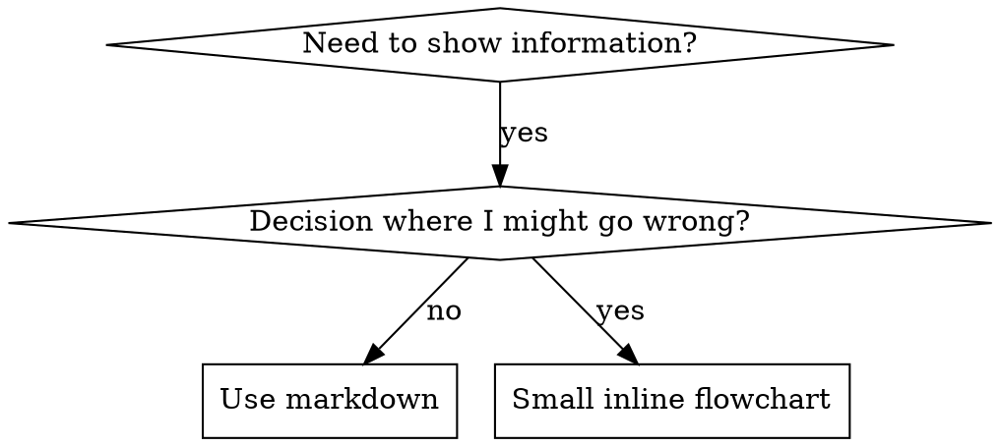

# ASO Examples And Rationalization Hardening

This reference holds detailed examples for `writing-skills`. The main skill contains the immediate rules; read this file only when designing trigger text or hardening discipline skills against rationalization.

## Description Examples

Bad descriptions summarize workflow and invite the agent to skip the full skill:

```yaml
# Bad: process summary instead of trigger
description: Use when executing plans - dispatches subagent per task with code review between tasks

# Bad: too much process detail
description: Use for TDD - write test first, watch it fail, write minimal code, refactor
```

Good descriptions state concrete triggering conditions:

```yaml
description: Use when executing implementation plans with independent tasks in the current session
description: Use when the user asks for TDD or a high-risk behavior change needs tests-first implementation
description: Use when tests have race conditions, timing dependencies, or pass/fail inconsistently
description: Use when using React Router and handling authentication redirects
```

Avoid vague, first-person, or overly narrow triggers:

```yaml
# Bad: too abstract
description: For async testing

# Bad: first person
description: I can help you with async tests when they're flaky

# Bad: implementation symptom for a broader skill
description: Use when tests use setTimeout/sleep and are flaky
```

## Keyword Coverage

Use terms agents are likely to search for:
- Error messages: `Hook timed out`, `ENOTEMPTY`, `race condition`.
- Symptoms: flaky, hanging, zombie, pollution.
- Synonyms: timeout/hang/freeze, cleanup/teardown/afterEach.
- Tools and file types: command names, library names, config files, script names.

## Naming Examples

Prefer active, descriptive names:
- `creating-skills` over `skill-creation`.
- `condition-based-waiting` over `async-test-helpers`.
- `using-skills` over `skill-usage`.
- `flatten-with-flags` over `data-structure-refactoring`.

Gerunds work well for processes: `creating-skills`, `testing-skills`, `debugging-with-logs`.

## Token Efficiency Examples

Move details to tool help:

```bash
# Bad: all flags in SKILL.md
search-conversations supports --text, --both, --after DATE, --before DATE, --limit N

# Good: canonical command plus help pointer
search-conversations supports multiple modes and filters. Run --help for details.
```

Use cross-references instead of repeating another skill:

```markdown
# Bad: repeat 20 lines of dispatch workflow
When searching, dispatch subagent with template...

# Good: required sub-skill marker
**REQUIRED SUB-SKILL:** Use dispatching-parallel-agents for the workflow.
```

Compress examples:

```markdown
# Verbose
User: "How did we handle authentication errors in React Router before?"
You: I'll search past conversations for React Router authentication patterns.
[Dispatch subagent with search query: "React Router authentication error handling 401"]

# Compact
User: "How did we handle auth errors in React Router?"
You: Searching...
[Dispatch subagent → synthesis]
```

## Cross-Referencing Other Skills

Use skill names only, with explicit requirement markers:
- Good: `**REQUIRED SUB-SKILL:** Use test-driven-development`.
- Good: `**REQUIRED BACKGROUND:** You MUST understand systematic-debugging`.
- Bad: `See skills/testing/test-driven-development`.
- Bad: `@skills/testing/test-driven-development/SKILL.md`.

Avoid `@` references because many harnesses force-load those files immediately, wasting context before the skill is needed.

## Rationalization Hardening

Baseline tests reveal the loopholes to close. Add explicit counters for the excuses agents actually used.

### Close Every Loophole Explicitly

Weak:

```markdown
Write code before test? Delete your own current-task implementation only when it can be safely isolated.
```

Stronger:

```markdown
Write code before test? Delete your own current-task implementation and start over only when it can be safely isolated.

No exceptions:
- Do not keep it as reference.
- Do not adapt it while writing tests.
- Do not look at it.
- If user or other-agent changes are mixed in, stop and ask before deleting or rewriting anything.
```

### Address Spirit-Vs-Letter Arguments

Use a foundational principle early:

```markdown
Violating the letter of the rules is violating the spirit of the rules.
```

This blocks “I followed the spirit” rationalizations.

### Build A Rationalization Table

```markdown
| Excuse | Reality |
|---|---|
| "Too simple to test" | Simple code breaks. Test takes 30 seconds. |
| "I'll test after" | Tests passing immediately prove nothing. |
| "Tests after achieve same goals" | Tests-after asks "what does this do?" Tests-first asks "what should this do?" |
```

### Create Red Flags

```markdown
## Red Flags - STOP And Start Over

- Code before test.
- "I already manually tested it."
- "Tests after achieve the same purpose."
- "It's about spirit, not ritual."
- "This is different because..."

All of these mean: stop using the non-TDD implementation. Delete and start over only for your own current-task changes when they can be safely isolated. If user changes, other-agent changes, or unrelated work are mixed in, stop and ask before deleting or rewriting anything.
```

## Flowchart Example

Use a flowchart only when it prevents a likely decision error:


